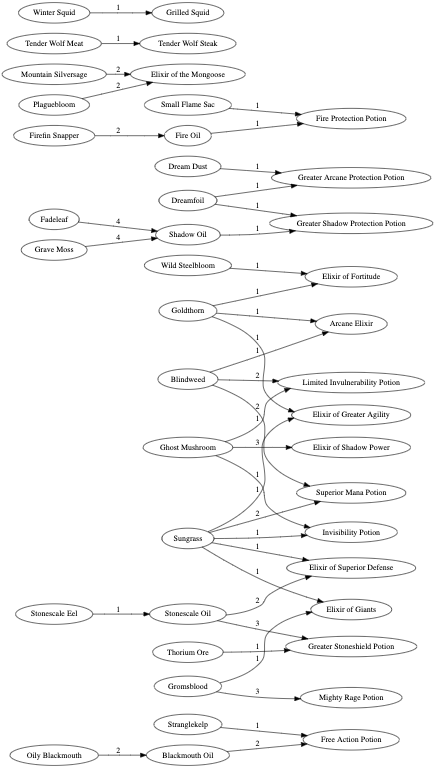

# WoW Auction engine

This project is an attempt to increase gold generated per hour in the game World of Warcraft (WoW).

### Background
By way of background, 'gold' in WoW is similar to real life money. Players earn gold from killing monsters, and this gold is used to buy items from other players. To facilitate this exchange, there is a centralised Auction House (AH). From there players can list their items for bid/buy, and use the AH to purchase items they need. In many ways, the AH is comparable with a 'stock market' with item value regularly changing. 

### Herbs and Potions
Some items in game such as herbs can be brewed into powerful potions. Herbs needs to be found and picked in the wild, and brewing usually requires being in the city with some time to spare. Because of these constraints on supply, these two markets (herbs, potions) can fall out of sync. And here is where we seek to collect value - buy herbs when there is high supply and sell potions when there is high demand.

### Keeping it simple
There are some simple strategies which can help players make money in such a chaotic situation. The basic concept of 'buy low sell high' tends to work well, but requires players to identify when prices are non-average. Cost plus pricing is not bad either, take the raw costs of materials add some profit and sell.

### A better system?
What would be more ideal is to have a system which could make pricing decisions for us. Such as when to buy herbs (if available), and for how much. The system may have to work with constraints such as overhead costs and inventory space. Then, it would tell how much to sell potions for, and how many. Because demand for potions drives our own demand for herbs, this process would identify limits to how many herbs we would want, and adjust accordingly.

### Constraints
In addition to usual supply and demand, there are some further constraints for this process to consider:
* Capital
* Inventory space
* Time
* Overhead costs (AH cut, vials, mail)

The capital constraint is an interesting one, and exists alongside another feature of the game. There is strong inflationary pressure in the game because every time monsters die, more gold is added to the game. What this means is over time gold becomes worth less, and items become worth more. Because of this, if we are saving for a very expensive item, we may be better off putting that capital into items and selling later. Thus free cash flow becomes a key consideration of the system.

We also don't have unlimited inventory space, so we should be careful to avoid a situation where low value items are crowding all the space. 

### Data tools at our disposal
Getting the right data at the right time is the name of our game. Short of having a full robot which can do everything for us (against the TOS), we will have to play within the rules of the game. We can move data in and out of the game via a restricted number of 'addons'. After some research, there are some addons which are perfect for us to interact with data. The plan is to update information, run program and seed new information, return to game.
- Auctioneer allows us to set a value for items and buy any item at that price or lower
- ArkInventory tells us how many of each item we have in our inventory
- Beancounter tells us our historic gold in / gold out, how much of each item has been bought, for how much, and how many auctions failed

### The plan
The overall aim is to increase profits given constraints of potion actual sale price, herb actual buy price, sale volume, herb market, time taken, capital, inventory space, current inventory, personal demand, fail rate, (out of stock), actions per day.

For simplicity, we assume unlimited capital and inventory space.

We allocate a fixed cost for time variable, such that we're earning 100g/h. We may earn higher or lower than this, this just becomes a constant in calculations help factor time. We introduce this for time spent crafting, and a general per unit penalty for time spent doing actions such as mail, movement, auctioning, relogging. The generic cost is expressed as 3s per item (about 100g/h), and crafting depends on recipe.

Personal demand is the number of goods reserved for use by my characters. We create a list of minimum reserved goods and subtract that from available inventory. This is mainly a convenience, and this approach can quickly inform how to top up all the characters.

The number of times we log in to execute the process helps determine inventory size. This is because we add more items to AH each time. When inventory size cap goes up, so too does our buy price as we look to fill the order. Thus we add a forward projection on how many logins we would do in the next week. 

To further simplify the problem, we will set soft and hard caps on max/min inventory of certain items, to help guide how pricing may scale based on how easy it is to attain items. 

This leaves us with buy prices, current inventory, sale prices, auction fail rate, and out of stock

Buy prices are determined by two variables, market rate on all goods for offer, and the current inventory size. When the inventory is high, we should lower our minimum buy price, to only accept bargins. When our inventory is low, we need to raise our buy price to repopulate.

To help analyse estimated profits, we record a geometric weighted average buy price figure.

Minimum sale price is determined by modelled value of the product given herb costs, vial costs, auction clears, auction fee, time spent to create (fixed g/h variable), global unit cost (another fixed price varible).

We use the minimum sale price to determine if we should sell. Any additional sale price is factored into an geometric weighted average sell price.

When the item does not meet the minimum sale price, this should signal that we carry less of the product and wait for input prices to cool down.

Note; What happens when the product is unavailable?

#### Herb buying process

1) Log in Amazoni
2) Collect AH mail to set inventory counts
3) Scan AH prices
4) Log out
5) Run program (sets herb prices)
6) Log in
7) Scan AH prices
8) Use Auctioneer 'Snatch', purchase all
9) Log out, repeat from 6 as required till price reset

Simple approach;
* Each item has an inventory cap, related to demand
* As inventory fills, so too should the price threshold, so only bargins get in

## Primary TODO
- [X] Create lists of items of interest
- [X] Find the total inventory of each item
- [X] Remove inventory reserved for character use
- [X] Define stack sizes for items of interest
- [X] Inventory needs to be split by location (auction, mailbox infinite), to give proper inventory constraint
- [ ] Reformat items of interest yaml to include recipes, self_demand
- [ ] Calculate sale price and standard deviation per item, with minimum sample, and preferring more recent data
- [ ] Calculate fail % per item, auction prices, auction cut
- [ ] Define constraints for max inventory size for stock

## Extra TODO
- [X] Create graph of potions
- [X] Given self-use list, create list of items to send to players
- [ ] Given buy and sell prices provide stocktake total (as range)

### Thoughts
6 slots per potion; (2x5, 4x1) x2

Lesser Invisibility Potion
Arcane Elixir
Gift of Arthas
Ghost dye
greater fire protection pot

Log in Amazoni,
Record AH prices
Check mail
Check mail on all characters as required
Log out
Run program, produces SELL lists. Records what is unsellable (price too low), and out of stock. Records inventory contents
* Sell as 5 stack / (Short 2h / Long overnight / VL)
Exit, run following.
* Sell as 1 stack / (Short 2h / Long overnight / VL)
Generates BUY list as well

Compare average buy herbs vs average sell potion; do so over a period of time, as a profitability line

--- Pick up project after creating second account, meaning need to find and collate information from a different source.

